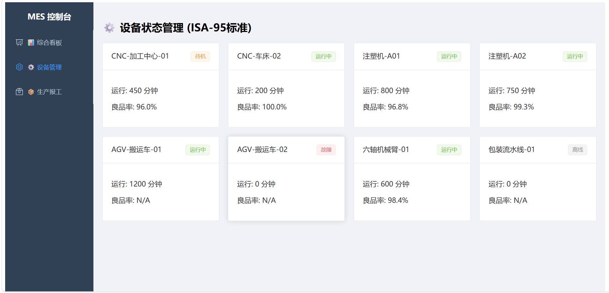
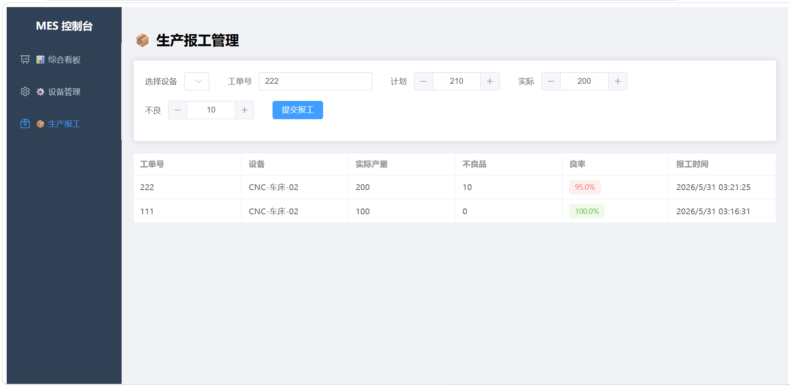
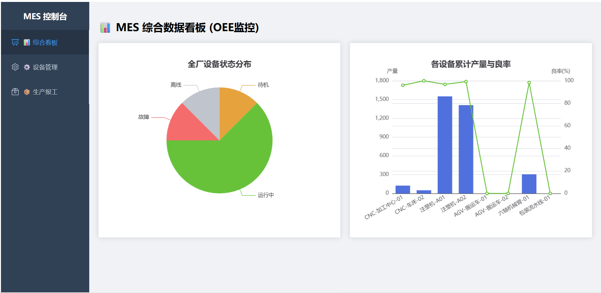

# Simple-MES-System 🏭

一个基于 FastAPI + Vue3 的轻量级制造执行系统 (MES)，采用前后端分离架构，虚拟小型工厂模拟。

## ✨ 功能特性与界面预览

- **设备管理模块**：支持 CNC、注塑机、AGV 等多种设备的状态监控与维护记录。
  <div align="center">
    
    <p><i>图 1：设备实时监控与管理面板</i></p>
  </div>

- **生产报工模块**：实时记录工单进度、良品率与缺陷统计。
  <div align="center">
    
    <p><i>图 2：生产报工与进度追踪</i></p>
  </div>

- **数据看板**：可视化展示 OEE (设备综合效率) 与生产趋势。
  <div align="center">
    
    <p><i>图 3：工厂综合数据可视化大屏</i></p>
  </div>

- **工程化架构**：后端路由/模型分离，前端组件化开发，易于扩展。
## 🛠️ 技术栈

- **Backend**: Python 3.9+, FastAPI, SQLModel (SQLite)
- **Frontend**: Vue 3, Vite, Element Plus, ECharts

## 🚀 快速开始

### 后端启动
```bash
cd backend
python -m venv venv
source venv/bin/activate # Windows: venv\Scripts\activate
pip install fastapi uvicorn sqlmodel
uvicorn backend.main:app --reload
```
### 前端启动
```bash
cd frontend
npm install
npm run dev
```
## 📂 项目结构

- **backend/**: FastAPI 后端服务
  - `models.py`: 数据库模型定义
  - `routes/`: API 路由接口
- **frontend/**: Vue3 前端应用
  - `src/views/`: 页面视图
  - `src/components/`: 公共组件
## 📄 License

MIT License
